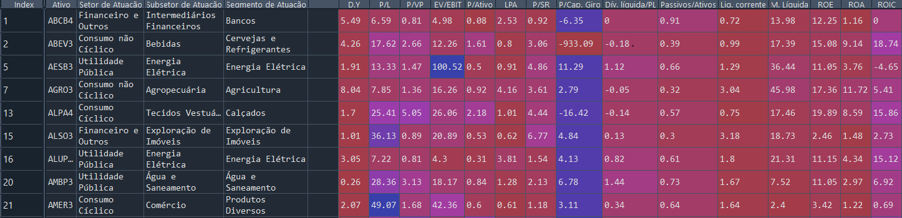
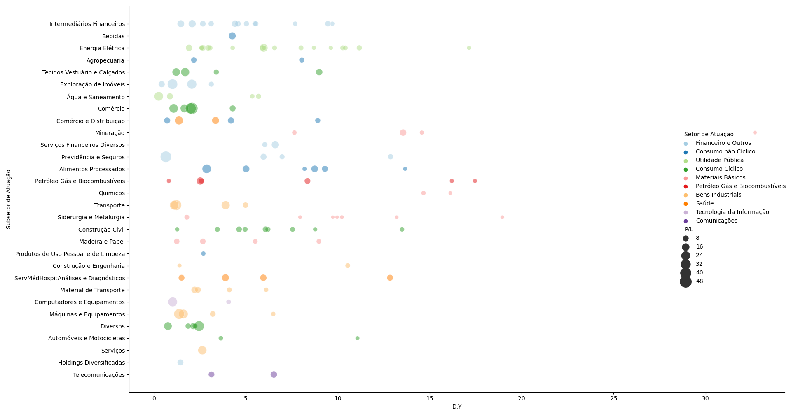
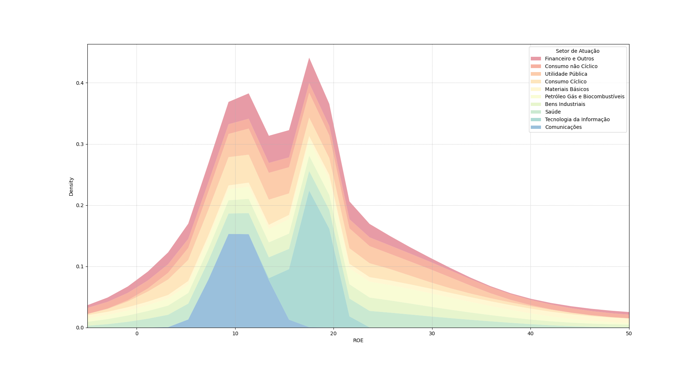
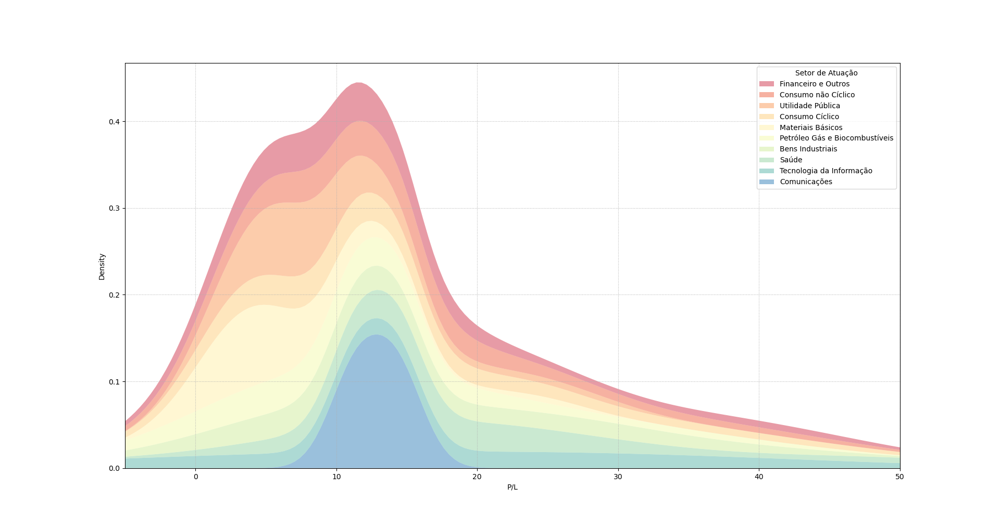

# fortunae
 Fortunae quer ser tornar uma biblioteca de análise financeira. Voltada pra importação de indicadores fundamentalistas de ações ou fundos imobiliarios usando multithreading. Usando a biblioteca `threads` para acelerar a coleta de dados automatizada e massiva. Funciona pra ativos brasileiros e BDR's.

## Download

Computer Version:

[](https://github.com/seu-usuario/seu-repositorio/releases)
[](https://github.com/seu-usuario/seu-repositorio/releases)
[](https://github.com/seu-usuario/seu-repositorio/releases)

## Instalação

Você pode instalar fortunae via `pip`

```md
pip install fortunae
```
## Extraindo dados de ações
Verificando indicadores fundamentalistas de ações

```python
import fortunae as ft

ações = ['mglu3', 'bbas3', 'cash3', 'disb34']
df_ações = ft.get_stocks(ações)
```
O `df_ações` será um dataframe com os ativos e seus indicadores. São identificados 43 indicadores fundamentalistas pra ações.

## Extraindo dados de fundos imobiliarios

Verificando indicadores fundamentalistas de fundos imobiliarios.

```python
import fortunae as ft

fiis = ['hglg11', 'knri11', 'bcff11']
df_fiis = ft.get_fiis(fiis)
```
O `df_fiis` será um dataframe com os ativos e seus indicadores. São identificados 23 indicadores fundamentalistas pra ações.

## Verificando lista de ativos
Verificando lista de ações
```python
import fortunae as ft

ações_lista = ft.br_stocks()
```
Verificando lista de fundos imobiliarios
```python
import fortunae as ft

ações_lista = ft.br_fiis()
```

## Atualização de ativos

```python
import fortunae as ft
import pandas as pd
import time 

start = time.time()

#Pegando a lista de ações e fundos
ações = ft.br_stocks() #473 ações
fiis = ft.br_fiis()    #250 fundos

#Scraping de dados usando threads
df_ações = ft.get_stocks(ações)
df_fiis = ft.get_fiis(fiis)

#Gravando os resultados
with pd.ExcelWriter('outputs.xlsx') as writer:  
    df_ações.to_excel(writer, sheet_name='acoes')
    df_fiis.to_excel(writer, sheet_name='FIIs')
    
print(f'Tempo de processamento gasto {(time.time() - start):.3f}s')
```
Esse código percorre `473 ações` e `250 fundos imobiliarios` listadas na `B3` pegando informações de 
preço e indicadores fundamentalistas. Após a coleta de dados concluida salva o arquivo em formato de planilha `.xlsx`. Esse operação dura em média `3min` e depende de conexão com a internet.

## Exemplos do DataFrame `df_ações`
Quando usar a função *get_stocks* ela retornará os indicadores de cada ativo informado em seu argumento em forma de um DataFrame. Assim, fica mais fácil executar análises, filtros e plotagem.



## Exemplos - Visualizando os dados do DataFrame

Com os dados do DataFrame agrupar por subsetor de atuação e visualizarmos como o `P/L` se distribui em cada setor.
```python

import pandas as pd
import seaborn as sns
import matplotlib.pyplot as plt
import numpy as np

#Filtrando dados
df = pd.read_excel('outputs.xlsx', index_col=False)
df = df[(df['VOLUME (dia)'] >=0.5e6) & (df['P/L']>0) & (df['P/L']<100)]

#Plot
sns.relplot(size="P/L", y="Subsetor de Atuação", hue="Setor de Atuação", x="D.Y",
            sizes=(40, 400), alpha=.5, palette="Paired",
            height=6, data=df[(df['D.Y'] > 0) & (df['D.Y'] < 50) & 
                              (df['P/L'] > 0) & (df['P/L'] < 50)])
```



Pode-se também fazer um histograma pra verificar como o `ROE` de distribuiu de acordo com cada setor de atuação.
```python

import pandas as pd
import seaborn as sns
import matplotlib.pyplot as plt
import numpy as np

#Filtrando dados
df = pd.read_excel('outputs.xlsx', index_col=False)
df = df[(df['VOLUME (dia)'] >=0.5e6) & (df['P/L']>0) & (df['P/L']<100)]

fig, ax = plt.subplots()
sns.kdeplot(
   data=df, x="ROE", hue="Setor de Atuação",
   fill=True, common_norm=False, palette="Spectral", multiple="stack",
   alpha=.5, linewidth=0,
)
ax.grid(linestyle='dotted')
ax.set_xlim(-5, 50)
```



Ou fazer um histograma pra verificar como o `P/L` de distribuiu de acordo com cada setor de atuação.
```python

import pandas as pd
import seaborn as sns
import matplotlib.pyplot as plt
import numpy as np

#Filtrando dados
df = pd.read_excel('outputs.xlsx', index_col=False)
df = df[(df['VOLUME (dia)'] >=0.5e6) & (df['P/L']>0) & (df['P/L']<100)]

fig, ax = plt.subplots()

sns.kdeplot(
   data=df, x="P/L", hue="Setor de Atuação",
   fill=True, common_norm=False, palette="Spectral", multiple="stack",
   alpha=.5, linewidth=0,
)

ax.grid(linestyle='dotted')
ax.set_xlim(-5, 50)

```




### Support ou contato

[](https://www.instagram.com/arthurchabole/)
[](https://twitter.com/Arthur__Chabole)
[](https://www.linkedin.com/in/arthur-chabole-1589a8149/)
